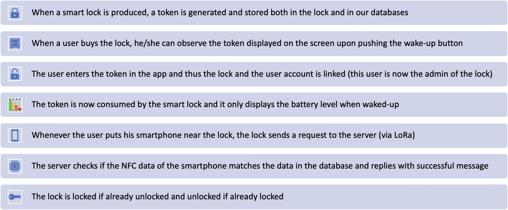
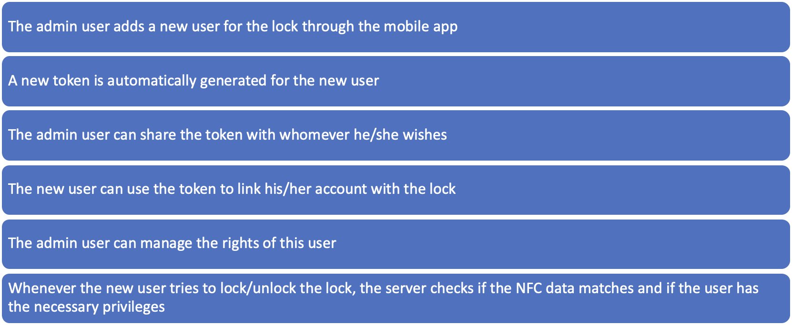

# Shareable Smart Lock

**Motivation**: Locks are used everywhere but they are often primitive. In a world changing by the advancement of technology, locks must also change. We offer a smart lock solution that allows to easily lock/unlock by the swing of a smartphone so that there are no longer need to carry physical keys. This smart lock also revolutionizes the world of locks by offering a solution that simplifies the sharing of access while ensuring data privacy and security.

**Core Features**

1. SMART LOCKING MECHANISM (via NFC)

2. SHARE THE LOCK WITH DIGITAL TOKENS

3. CONTROL ACCESS RIGHTS

4. MONITOR LOCK HISTORY

**Optional Features**

1. LOCATION TRACKING (VIA GPS)

2. ALSO CONTROLLABLE BY PHYSICAL KEY

**Hardware**

- Heltec WiFi LoRa 32 (V3)
- PN532 (as NFC reader)
- Servo motor and small metal pipe (for the physical lock)
- Rechargeable battery (capacity will be determined later)
- A small button (to wake the screen)

**Typical Scenario**

**Lock Sharing Scenario**

