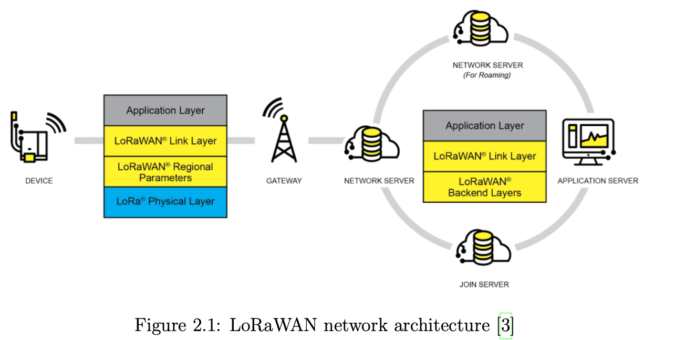

# IoT-based greenhouse monitoring

**Aim**: 

1. Improve real-time data access.
2. Simplify monitoring processes.
3. Modernize greenhouse management.

**Method**:

To create a connected, scalable, and self-sustainable device that is cost-effective and easy to deploy.

> IoT-based monitoring system capable of transmitting data to the cloud, allowing easy, real-time access from anywhere, eliminating the need for direct interaction with the physical location of data collection.

## Background Concept

### **Four interconnected components**

1. *Device*: Things(physical objects) embedded with sensors and actuators that gather and interact with information directly from their environment.
2. *Connectivity*: The devices use Various technologies to communicate and transfer data, such as Wi-Fi, Bluetooth, and LPWAN.
3. *Data processing*: Once data is collected, it is processed.
4. *User interface*: This enables humans to interact with the IoT system.

### **Wireless communication protocols' factors**

1. *Network range*: Define the maximum distance data can be reliably transmitted.
   1. Long Range: LoRaWAN
   2. Short Range: Wi-Fi, Bluetooth, and Zigbee
2. *Data Rate*: Determine the data transmission speed.
3. *Power Consumption*: An essential consideration for battery-powered devices.

### **LoRaWAN**

**Chirp Spread Spectrum**

A spread spectrum technique uses wideband linear frequency-modulated chirp pulses to encode information.

A Chirp is a sinusoidal signal whose frequency increases or decreases over time.

**Architecture**




1. *Device*: These are sensors or actuators that send LoRa-modulated wireless messages to gateways or receive messages from them.
2. *Gateways*: These devices receive messages from end devices and forward them to the Network Server
3. *Network Server*: It manages gateways, end devices, applications, and users in the entire network.
4. *Application Server*: It ensures secure processing of application data. It also provides the means for the end devices to interact with the user applications and services.
5. *Join Server*: The join server is critical in securing device activation, root key storage, and session key generation.

LoRaWAN networks employ an `ALOHA-based` protocol, so end devices do not need to establish a connection with specific gateways. Messages sent by end devices are broadcasted to all gateways within range. The `Network Server` receives these messages and discards duplicated messages by the `message deduplication` process.

**Message Type**

*Uplink message*: End devices transmit it to the Network Server through gateways. If the uplink transmission is intended for the Application Server or Join Server, the Network Server routes it accordingly.

*Downlink message*: The Network server sends it to an end device.

**[Device Classes](https://www.thethingsnetwork.org/docs/lorawan/classes/)**

Class A, B, and C are the three device classes specified by LoRaWAN. All LoRaWAN devices must support Class A. Class B, and Class C are optional extensions to Class A.

*Class A*: Listen only after transmission

*Class B*: Listen periodically. In addition to Class A receive slots, class B devices open extra receive slots at scheduled times. The end node receives a time-synchronized beacon from the gateway, allowing the gateway to know when the node is listening.

*Class C*: Always listen

```
Class B

Beacons: to synchronize end devices every 128 seconds
Ping-slots: to receive downlinks every ping-period
Ping-slot periodicity: a parameter that dictates the ping period
	ping period = 2 ^ (periodicity + 5)
Slot randomizaiton: the start of the first ping slot is randomized, to avoid overhearing and systematic collisions.
```

> A Class C device does not support device B functionality and vice versa.

**[End device activation and security](https://www.thethingsnetwork.org/docs/lorawan/end-device-activation/)**

*Aim*: to send and receive messages.

---

*Over-The-Air Activation(OTAA)*

It is the most secure method.

1. A device identifier(DevEUI): Uniquely identifies the end device.
2. An application identifier(AppEUI) uniquely identifies the entity that processes the Join-req frame.
3. An application key(AppKey) is known only by the device and the application.
4. DevNonce: a unique, random, 2-byte value generated by the end device. The Network Server uses the DevNonce of each end device to keep track of their join requests. If an end device sends a join request with a previously used DevNonce(this situation is known as a replay attack), the Network Server rejects the join request and does not allow that end device to register with the network.

*Join-request*: from the end device to the Network Server

*Join-accept*: from Network Server to the end device

Before activation, the AppEUI, DevEUI, and AppEUI should be stored in the end device. 

> The AppKey should never sent over the network.

*Step 1*

The join-request message consists of the following fields.

* 8 bytes: AppEUI

* 8 bytes: DevEUI

* 2 bytes: DevNonce

*Step 2*

The Network Server processes the Join request message. The Network Server will generate two session keys(NwkSKey and AppSkey) and the Join-accept message if the end device is permitted to join a network.

The Join accept message consists of the following fields.

* 3 bytes AppNonce: It is used by the end device to derive the two session keys.
* 3 bytes NetID consists of the network identifier(NWKID), the most significant 7 bits.
* 4 bytes DevAddr: it is used by the Network Server to identify the end device within the current network
* 1 byte DLSetttings consists of a downlink setting, which the end device should use
* 1 byte RXDelay: contains the delay between the TX and RX
* 16 bytes CFList: an optional list of channel frequencies for the network the end device is joining. These frequencies are region-specific.

---

*Activation By Personalization(ABP)*

Activation by Personalization directly ties an end device to a pre-selected network, passing the over-the-air-activation procedure. Activation by Personalization is the less secure activation method and has the downside that devices can not switch networks without manually changing keys. A Join Server is not involved in the ABP process.